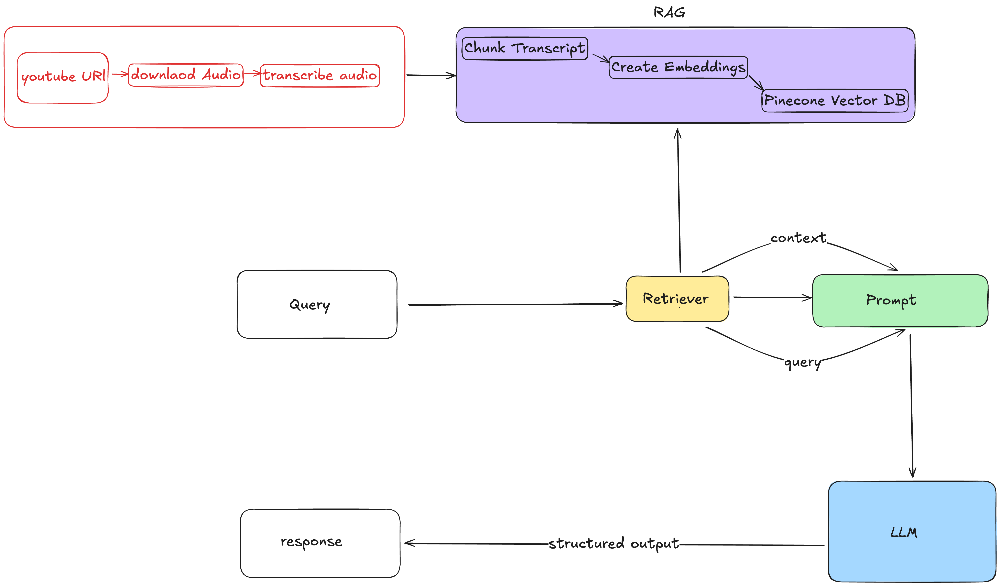

# RAG With Pinecone: YouTube Transcript QA Pipeline

## Overview

This repository demonstrates a complete end-to-end workflow for building a **Retrieval-Augmented Generation (RAG)** system utilizing Pinecone as a vector database, LangChain for orchestration, Whisper for audio transcription, and OpenAI models for semantic embedding and answering queries.

- Download and transcribe YouTube video audio.
- Chunk and embed transcripts using OpenAI embeddings.
- Store semantic chunks in a Pinecone vector database.
- Retrieve relevant text chunks to answer user questions via a local RAG pipeline.

---

## Architecture

Below is a flow diagram of the RAG pipeline from YouTube input to response generation:

---

## Features

- Automatic download and transcription of YouTube audio.
- Semantic chunking of transcripts for fine-grained retrieval.
- Embedding via OpenAI and storage in Pinecone vector DB.
- Retrieval and answer generation using LangChain and LLMs.
- Fully Colab-compatible—installation and setup included.

## Dependencies

- `pinecone`
- `langchain`, `langchain-openai`, `langchain-pinecone`, `langchain-experimental`
- `git+https://github.com/openai/whisper.git`
- `yt-dlp`
- `tqdm`, `pydub`
- `numpy`

## Setup

1. **Google Colab**  
   Open the notebook in Google Colab.

2. **Environment Variables**  
   The notebook expects API keys (OpenAI and Pinecone) via `google.colab.userdata`:
   - `OPENAI_API_KEY`
   - `PINECONE_API_KEY`
   - `PINECONE_ENVIRONMENT` (default: `us-east1-aws`)

3. **Google Drive Mount**  
   The notebook mounts Google Drive for saving audio/transcripts.

## Workflow Breakdown

### 1. Install & Import Dependencies
Installs all necessary libraries with `pip`.

### 2. API Keys & Environment Setup
Retrieves API keys securely from Colab `userdata`.

### 3. Download and Transcribe YouTube Video
Parses video ID, downloads audio, transcribes with Whisper.

### 4. Semantic Chunking of Transcript
Splits transcript into semantic chunks with LangChain.

### 5. Embedding and Upload to Pinecone
Embeds text chunks, uploads to Pinecone.

### 6. Retrieval and QA with LangChain
Sets up retriever, passes relevant context and query to the LLM for QA.

### 7. Example Usage
query = "What is a LangGraph or an agent according to the video?"
answer = rag_chain.invoke(query)
print("Answer:", answer)

## How to Use

1. Upload/duplicate the notebook.
2. Provide API keys via Colab.
3. Set your YouTube URL in the relevant cell.
4. Run all cells.
5. Ask questions in the provided cell to test semantic QA.

## Notes

- For research/demo use. Mind OpenAI and Pinecone API costs.
- For production, never expose API keys. Add error handling.
- Check licensing for Whisper and yt-dlp.

## Author

**Priyanshu Kumar** 

